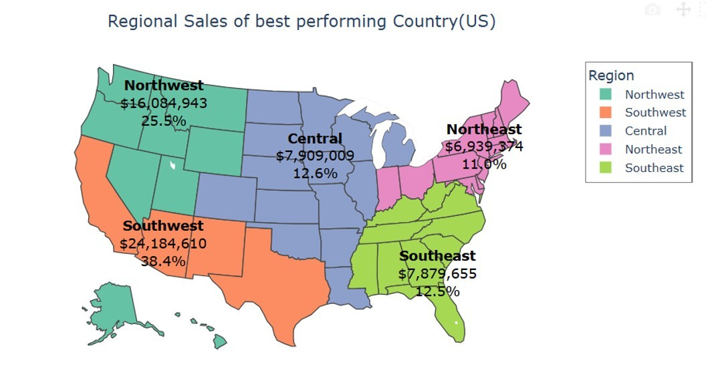
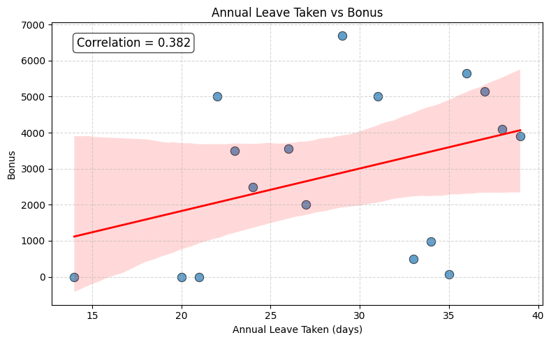
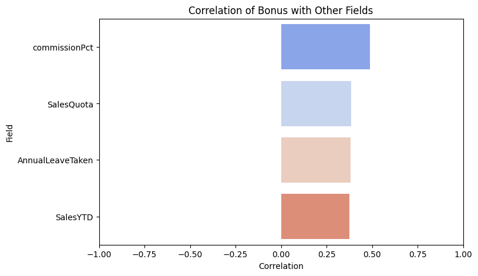

# Adventure Works Database Analysis 

## Project overview

## Question 1 What are the regional sales in the best-performing country?.

## Insight:
The Southwest region is the market leader, generating over $ 24.184 million in sales and contributing 38.4% of the country's total sales. This performance demonstrates a highly effective business operation that successfully meets the demand in this area.

The Northwest region holds the position of the second-highest market with $16,084,943 in sales, contributing 25.5% of the total. When combined with the Southwest, these two regions account for over 60% of the total sales, clearly indicating that the Western part of the country is the primary market.
The rest of the regions:
Northeast: $6,939,374 (11.0%)
Southeast: $7,875,655 (12.5%)
Central: $7,909,009 (12.6%)

## Question 2 Calculate the total population for all African countries in 2010. Create a bar chart showing the population distribution across African countries in 2010.

## Insight:
The correlation coefficient of 0.382 indicates a positive relationship between the two variables.
However, a correlation coefficient of 0.3 is considered weak. This means the relationship is not
strong enough to establish a consistent pattern.
Therefore, the amount of annual leave taken is not a strong indicator for predicting the bonus
amount. Other factors, such as meeting the Sales Quota or the commission, likely have a much
stronger correlation with the bonus.

Bonuses are mostly linked to pay-related factors, especially commission percentage and sales
quota, rather than leave. This means the bonus system mainly rewards senior roles and sales
responsibility, with some influence from actual sales performance (SalesYTD).
